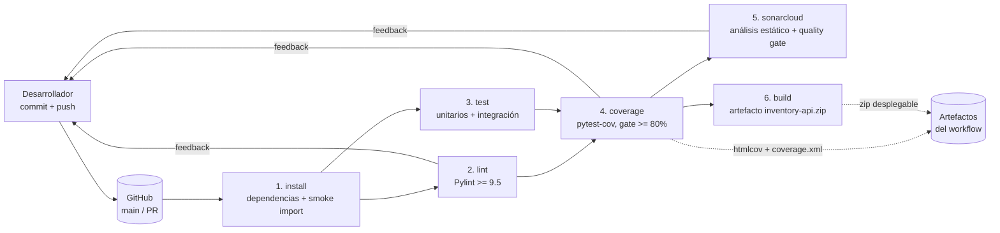

# CI_REPORT — Pipeline de Integración Continua

**Proyecto:** Inventory API (servicio REST de inventario con Flask)
**Stack:** Python 3.10 · Flask 3.0 · uv · Pytest · Coverage.py · Pylint · SonarCloud · GitHub Actions

---

## 1. Diagrama del pipeline

Los jobs están encadenados con `needs:`. En la práctica eso significa que `build` y `sonarcloud` solo corren si lint, tests y el gate de cobertura pasaron antes; no hay forma de que salga un artefacto de un commit roto. `lint` y `test` van en paralelo después de `install` para no sumar sus tiempos.

## 2. Stages del workflow (`.github/workflows/ci.yml`)

| # | Stage | Qué hace | Falla si... |
|---|---|---|---|
| 1 | `install` | Instala dependencias con `uv sync --locked` (falla si `uv.lock` está desactualizado) y verifica que la app importa y arranca (smoke) | el lock no coincide con `pyproject.toml`, una dependencia está rota o la app no importa |
| 2 | `lint` | `uv run pylint src config --fail-under=9.5` | el puntaje baja de 9.5/10 |
| 3 | `test` | Ejecuta tests unitarios y de integración por separado, con salida verbosa | cualquier test falla |
| 4 | `coverage` | Re-ejecuta la suite con `pytest-cov` (statements + branches), publica `htmlcov/` y `coverage.xml` como artefactos | cobertura total < 80% |
| 5 | `sonarcloud` | Análisis estático con quality gate de SonarCloud, usando `coverage.xml` | el quality gate no pasa (se omite con aviso si falta `SONAR_TOKEN`) |
| 6 | `build` | Empaqueta `src/`, `config/`, `pyproject.toml` y `uv.lock` en `inventory-api.zip` listo para despliegue | el empaquetado falla |

Para las dependencias usé uv en lugar de pip. `pyproject.toml` declara lo que el proyecto necesita y `uv.lock` congela las versiones exactas de todo el árbol (25 paquetes). En CI instalo con `--locked`, que rompe el build si alguien toca dependencias sin regenerar el lock; con eso el entorno del pipeline queda igual al de mi máquina. De paso, la instalación en CI es bastante más rápida que con pip.

## 3. Métricas de calidad

Ninguno de estos números es estimado: salen de correr las herramientas sobre la versión final del código.

| Métrica | Valor | Herramienta |
|---|---|---|
| Tests unitarios | 49 (mínimo exigido: 10) | pytest |
| Tests de integración | 21 (mínimo exigido: 5) | pytest |
| Cobertura total (statements + branches) | 99.7% | Coverage.py (`--cov-branch`) |
| Cobertura por módulo | 100% en todos, salvo `routes.py` (98.4%) | Coverage.py |
| Puntaje de lint | 10.00 / 10 | Pylint 3.2 |
| Complejidad ciclomática promedio | A (2.23), 43 bloques analizados, ninguno pasa de grado A/B | radon |
| Issues de lint abiertos | 0 | Pylint |

La única rama no cubierta (`routes.py` 52→56) es la combinación "query param `threshold` presente y numérico" dentro del parseo del endpoint low-stock. Revisé el caso: las cuatro variantes de entrada sí tienen test, la rama parcial es un artefacto de cómo Coverage.py cuenta los branches.

### Funcionalidades desarrolladas con TDD

1. `adjust_stock` (ajuste de inventario). Escribí primero los tests de `TestAdjustStock` (8 casos, incluyendo el edge de dejar el stock exactamente en 0, que un bool no cuente como entero válido y que dos ajustes seguidos realmente se acumulen) y después el método. La regla más importante, que el stock nunca quede negativo, nació como test en rojo.
2. `get_low_stock` (alerta de stock bajo). Los 5 casos de `TestLowStock` definieron el contrato antes de que existiera el código: umbral inclusivo y configurable por query param, umbral 0 significa "agotados", umbral inválido se rechaza.

## 4. Justificación de thresholds

**Cobertura ≥ 80% (statements y branches).** Dejé el umbral en 80% porque con menos quedan rutas de error sin verificar, y exigir 100% obliga a testear código trivial y termina frenando más de lo que aporta. Mido también cobertura de *branches* porque un `if` con una sola rama probada puede dar 100% de líneas y aun así esconder un bug. El proyecto entrega 99.7%, o sea casi 20 puntos de margen sobre el gate; me pareció importante que no quedara al límite, para que un refactor normal no rompa el pipeline por décimas.

**Pylint ≥ 9.5/10 (no 10.0).** Aunque el código hoy está en 10.00, no puse el gate ahí a propósito: exigir 10.0 convierte cualquier falso positivo del linter en un pipeline bloqueado. Con 9.5 igual se nota una degradación real (código muerto, imports sin usar, complejidad que crece) sin esa fricción.

**Quality gate de SonarCloud (perfil "Sonar way" para new code).** Mantuve el perfil por defecto (0 bugs nuevos, 0 vulnerabilidades nuevas, duplicación < 3%). El proyecto nace limpio, así que no vi razón para aflojar nada desde el primer commit.

## 5. Feedback loops configurados

Diseñé los loops partiendo de algo que veo a diario en mi trabajo: mientras más tarde aparece un error, más caro sale arreglarlo. Cada loop está pensado para dar la señal más rápida posible en su etapa.

| Loop | Disparo | Tiempo de feedback | Qué detecta |
|---|---|---|---|
| 1. Tests locales | `pytest` antes de commit | ~0.2 s | Regresiones de lógica, mientras todavía tengo el contexto fresco en la cabeza |
| 2. Lint local | `pylint src config` | ~2 s | Code smells y errores estáticos antes de subir |
| 3. Smoke de instalación (CI) | push / PR | ~15–25 s | Dependencias rotas o app que no arranca; corta el pipeline temprano y no gasta minutos en tests que igual fallarían por entorno |
| 4. Lint + tests en CI (paralelo) | push / PR | ~1–2 min | Lo mismo que los loops locales, pero en una máquina limpia (no en la mía, con mi venv y mis rarezas) |
| 5. Gate de cobertura | push / PR | ~2 min | Código nuevo sin tests. Falla el build, no depende de que alguien se acuerde de revisar |
| 6. Quality gate SonarCloud | push / PR | ~3 min | Bugs, vulnerabilidades, duplicación y deuda técnica que el linter local no ve |
| 7. Checks en PR + branch protection | apertura de PR | antes del merge | Impide integrar a `main` cualquier cambio con el pipeline en rojo |
| 8. Artefactos publicados | fin del workflow | post-build | `htmlcov/` navegable e `inventory-api.zip` desplegable; de cada ejecución queda registro descargable |

**Justificación de los tiempos.** El loop que más se ejecuta (los tests locales) tiene que ser el más rápido, porque al correrlo decenas de veces al día cada segundo extra se multiplica. Que responda en ~0.2 s es consecuencia de una decisión de diseño: separé la lógica de negocio de Flask, así que los 49 tests unitarios no levantan ningún servidor HTTP. Los loops de CI pueden permitirse 1 a 3 minutos porque corren pocas veces al día y a cambio dan garantías que lo local no da (entorno reproducible, historial, bloqueo del merge). Y el orden de los stages sigue la misma lógica: primero lo barato (install, lint) y después lo costoso (coverage, Sonar). Si el lint falla a los 40 segundos, no tiene sentido gastar 3 minutos en el resto.

## 6. Evidencias

- Reporte de cobertura navegable: `htmlcov/index.html` (también publicado como artefacto en cada ejecución del workflow).
- `coverage.xml` consumido por SonarCloud.
- Workflow: `.github/workflows/ci.yml` · Lint: `pyproject.toml` · Sonar: `sonar-project.properties`.
- Screenshot del dashboard de SonarCloud: `docs/sonarcloud-dashboard.png` (se sube después de la primera ejecución del pipeline con el token configurado).
